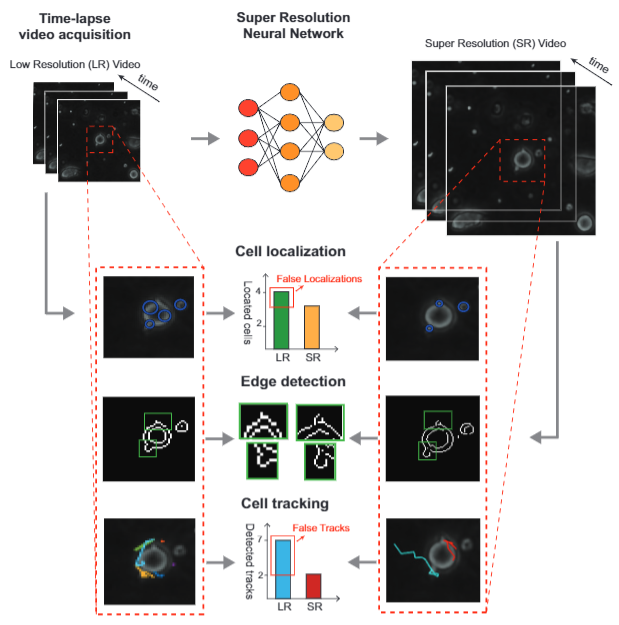

# RDPV
Recursive Deep Prior Video: a Super Resolution algorithm for Time-Lapse Microscopy oforgan-on-chip experiments

The uploaded codes are a preminary version of the codes used in our paper. 
Working in progress....

If you use our codes, please consider to cite our work: 

https://arxiv.org/pdf/2011.09855.pdf

